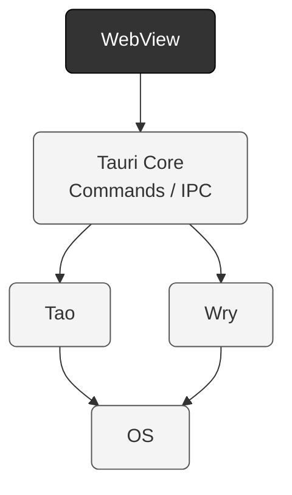

### 一、环境搭建

#### 基础必要环境

> 仅以mac环境作为演示

##### 1.nodejs 

安装 [nodejs安装指南](https://nodejs.org/zh-cn/download)

```bash
node -v

v22.17.0
```

##### 2.rust

安装 [rust安装指南](https://rust-lang.org/zh-CN/tools/install/)

```bash
curl --proto '=https' --tlsv1.2 -sSf https://sh.rustup.rs | sh
```

验证
```bash
rustc --version

rustc 1.91.0 (f8297e351 2025-10-28)
```

##### 3.Xcode

应用商店安装即可


##### 4.webView2

这个比较特殊，mac 不需要安装，但window 平台需注意，我查了下自带webView2的windows系统版本


##### 5. 安卓和ios 的暂不考虑，主要是以桌面端为准


好的，到这里，安装基础依赖结束，让我们准备迎接 Hello World!

### 二、创建项目

我这里选择的是使用`cargo` (rust 包管理工具)

```bash
cargo install create-tauri-app --locked
cargo create-tauri-app
```

如果使用npm 更简单一些
```bash
npm create tauri-app@latest
```


进入工程后

项目结构主要是`src` `src-tauri` 


然后通过 `npm` 命令启动项目 

```bash
npm run tauri dev
```

Hello,World! 成功啦！   ☀️


### 三、Tarui 架构个人理解

> Tauri = 用 Web 技术写前端界面 + 用 Rust 做系统层后端，通过 IPC 通信连接两者。


官网的架构图，更多的体现的是系统实现层(运行时架构/平台抽象)





### 四、进程间关系
这个与我上面理解的 个人技术架构上基本一致呢

WebView 进程 和 核心进程

一对多的关系
